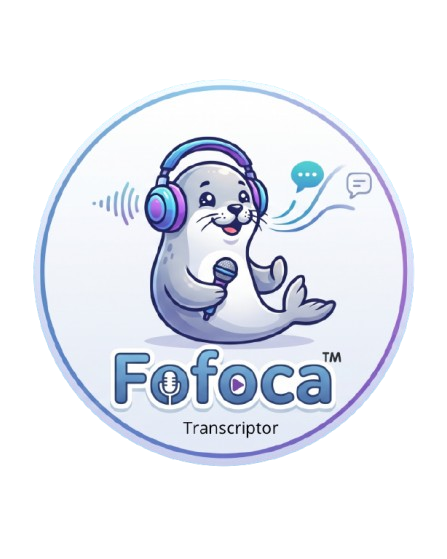
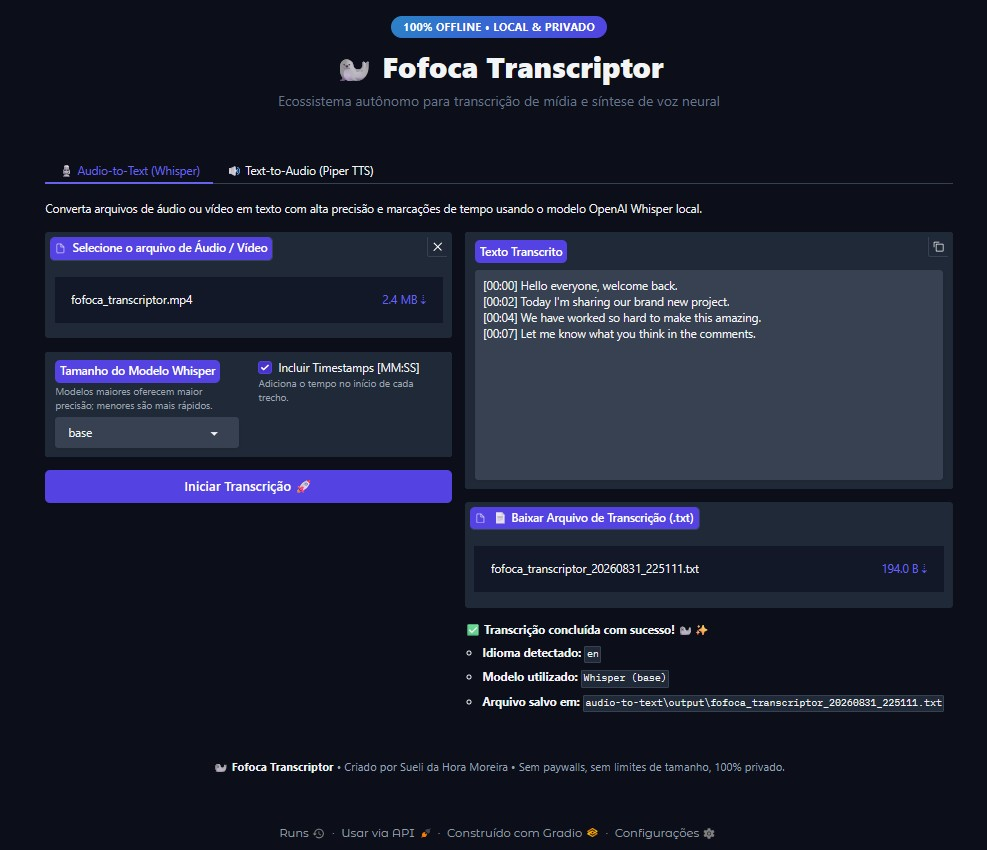
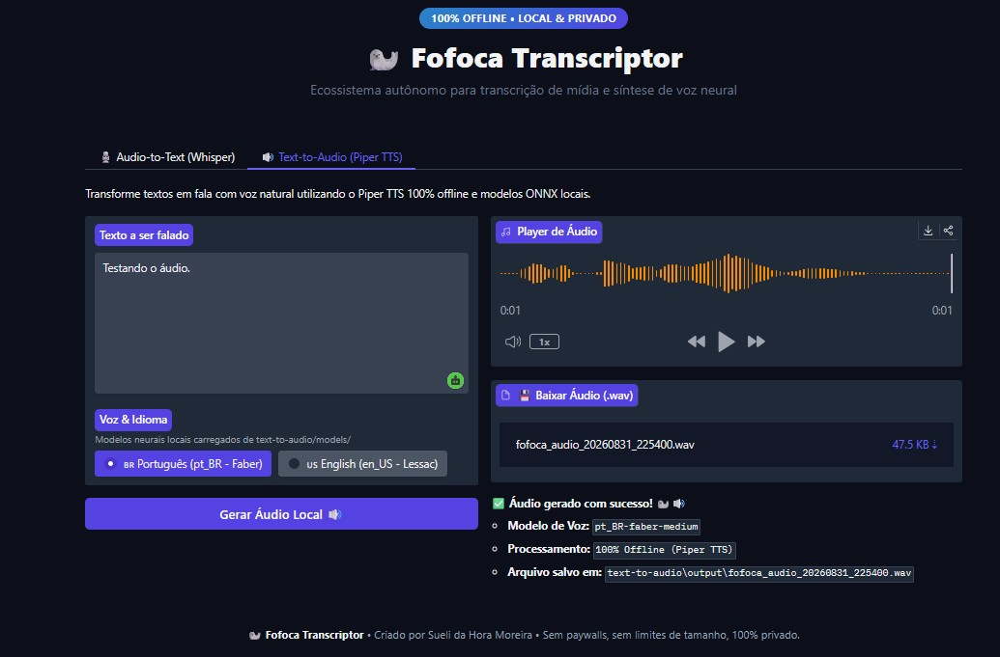

<div align="center">
  <p align="right">
    <b>English</b> | <a href="./README_pt.md">Português</a>
  </p>

  
  <h1>Fofoca Transcriptor</h1>
  <p><b>An Intelligent, 100% Offline Ecosystem for Media Transcription and Neural Speech Synthesis</b></p>

  [](https://www.python.org/)
  [](https://gradio.app/)
  [](https://github.com/openai/whisper)
  [](https://github.com/rhasspy/piper)
  [](LICENSE)

  <p><i>Engineered by <b>Sueli da Hora Moreira</b></i></p>
</div>

---

## 📖 About the Project

**Fofoca Transcriptor** is a modular Python toolkit engineered for **audio/video transcription** and **neural text-to-speech synthesis** executing entirely on local infrastructure. It eliminates external cloud dependencies, subscription barriers, API rate limits, and file size constraints.

### 💡 Motivation & Architecture Goals

The project was designed to address common friction points encountered when processing extensive technical audio recordings (such as 2+ hour lectures on LLMs and RAG architectures):
* **No File Size or Duration Limits:** Standard web tools impose restrictive daily caps and fail on long audio files. Fofoca Transcriptor processes files of any size without restriction.
* **100% Data Privacy:** Zero outbound network traffic for inference. All media, transcripts, and audio files remain strictly confidential on the local machine.
* **Cost Efficiency & Autonomy:** Replaces recurring paid transcription services with state-of-the-art open-source neural models running on consumer hardware.

---

## 🖼️ Interface Demonstration

The application offers an intuitive and responsive graphical user interface built with **Gradio**, divided into two specialized workflows:

### 🎙️ 1. Audio-to-Text Module (Whisper)
> High-accuracy automatic speech recognition (ASR) supporting standard audio and video formats, multi-tier model selection, and synchronized timestamp generation.

<div align="center">
  
</div>

<br>

### 🔊 2. Text-to-Audio Module (Piper TTS)
> Fast local neural text-to-speech synthesis using optimized ONNX runtime voice models, featuring instantaneous browser playback and `.wav` export.

<div align="center">
  
</div>

---

## ✨ Key Capabilities

* 🔒 **Local & Air-Gapped Execution:** Full offline inference for both speech-to-text and text-to-speech workflows.
* 🎯 **OpenAI Whisper Transcription Engine:**
  * Configurable model granularity: `tiny`, `base`, `small`, `medium`, and `large`.
  * Automatic language identification across 90+ languages.
  * Segmented timestamp formatting (`[MM:SS]`) for seamless navigation.
  * One-click clipboard copy and automated `.txt` export.
* 🗣️ **Piper Neural TTS Engine:**
  * High-performance local ONNX voice models:
    * **Portuguese (pt_BR):** `pt_BR-faber-medium`
    * **English (en_US):** `en_US-lessac-medium`
  * Direct audio streaming and `.wav` download.
* 🗂️ **Clean Codebase & Extensibility:** Decoupled CLI modules (`transcriber.py`, `speaker.py`) unified under a production-ready Gradio entrypoint (`app.py`).

---

## 🛠️ Tech Stack

| Component | Technology | Purpose |
|---|---|---|
| **Language** | Python 3.12+ | Core runtime environment |
| **Web Interface** | Gradio 6.x | Interactive browser UI |
| **ASR Engine** | OpenAI Whisper | Automatic speech recognition & timestamp alignment |
| **TTS Engine** | Piper TTS | Neural speech synthesis via ONNX runtime |
| **Deep Learning** | PyTorch & TorchAudio | Tensor computation & media processing backend |
| **Package Management** | uv / pip | Deterministic dependency resolution |

---

## 📂 Directory Structure

```text
fofoca/
├── assets/                  # Brand assets and UI preview captures
│   ├── logo.png             # Project emblem
│   ├── telaAT.jpg           # Audio-to-Text tab screenshot
│   └── telaTA.jpg           # Text-to-Audio tab screenshot
├── audio-to-text/           # Transcription subsystem
│   ├── input/               # Staging area for raw audio/video files
│   ├── output/              # Processed transcription transcripts (.txt)
│   └── src/                 # Whisper processing script (transcriber.py)
├── text-to-audio/           # Speech synthesis subsystem
│   ├── input/               # Source text files (.txt)
│   ├── models/              # Neural ONNX voice models & JSON definitions
│   │   ├── pt_BR-faber-medium.onnx
│   │   ├── pt_BR-faber-medium.onnx.json
│   │   ├── en_US-lessac-medium.onnx
│   │   └── en_US-lessac-medium.onnx.json
│   ├── output/              # Synthesized audio files (.wav)
│   └── src/                 # Synthesis script (speaker.py)
├── app.py                   # Gradio Web Application
├── main.py                  # CLI Entrypoint
├── pyproject.toml           # Package configuration & dependencies
├── README.md                # Documentation (English)
└── README_pt.md             # Documentation (Português)
```

---

## 🚀 Local Installation & Setup

### Prerequisites

* **Python 3.12** or newer
* **FFmpeg** installed and added to the system `PATH`
* **Git**

### 1. Clone the Repository

```bash
git clone https://github.com/SueliHora/fofoca.git
cd fofoca
```

### 2. Set Up Environment & Install Dependencies

#### Using `pip`

```bash
# Create and activate virtual environment
python -m venv .venv

# Windows (PowerShell)
.venv\Scripts\Activate.ps1

# Linux / macOS
# source .venv/bin/activate

# Install dependencies
pip install .
```

#### Using `uv` (Recommended)

```bash
uv sync
```

### 3. Fetch Neural Voice Models (If Not Present)

```bash
# Brazilian Portuguese Model (pt_BR - Faber)
curl -L -o "text-to-audio/models/pt_BR-faber-medium.onnx" "https://huggingface.co/rhasspy/piper-voices/resolve/main/pt/pt_BR/faber/medium/pt_BR-faber-medium.onnx"
curl -L -o "text-to-audio/models/pt_BR-faber-medium.onnx.json" "https://huggingface.co/rhasspy/piper-voices/resolve/main/pt/pt_BR/faber/medium/pt_BR-faber-medium.onnx.json"

# American English Model (en_US - Lessac)
curl -L -o "text-to-audio/models/en_US-lessac-medium.onnx" "https://huggingface.co/rhasspy/piper-voices/resolve/main/en/en_US/lessac/medium/en_US-lessac-medium.onnx"
curl -L -o "text-to-audio/models/en_US-lessac-medium.onnx.json" "https://huggingface.co/rhasspy/piper-voices/resolve/main/en/en_US/lessac/medium/en_US-lessac-medium.onnx.json"
```

### 4. Run the Application

Launch the Gradio server:

```bash
python app.py
```

*(or `uv run python app.py`)*

Open your browser and navigate to:
👉 **[http://localhost:7860](http://localhost:7860)**

---

## 📜 License

This project is licensed under the [MIT License](LICENSE).

---

<div align="center">
  <p>Created by <b>Sueli da Hora Moreira</b></p>
</div>
