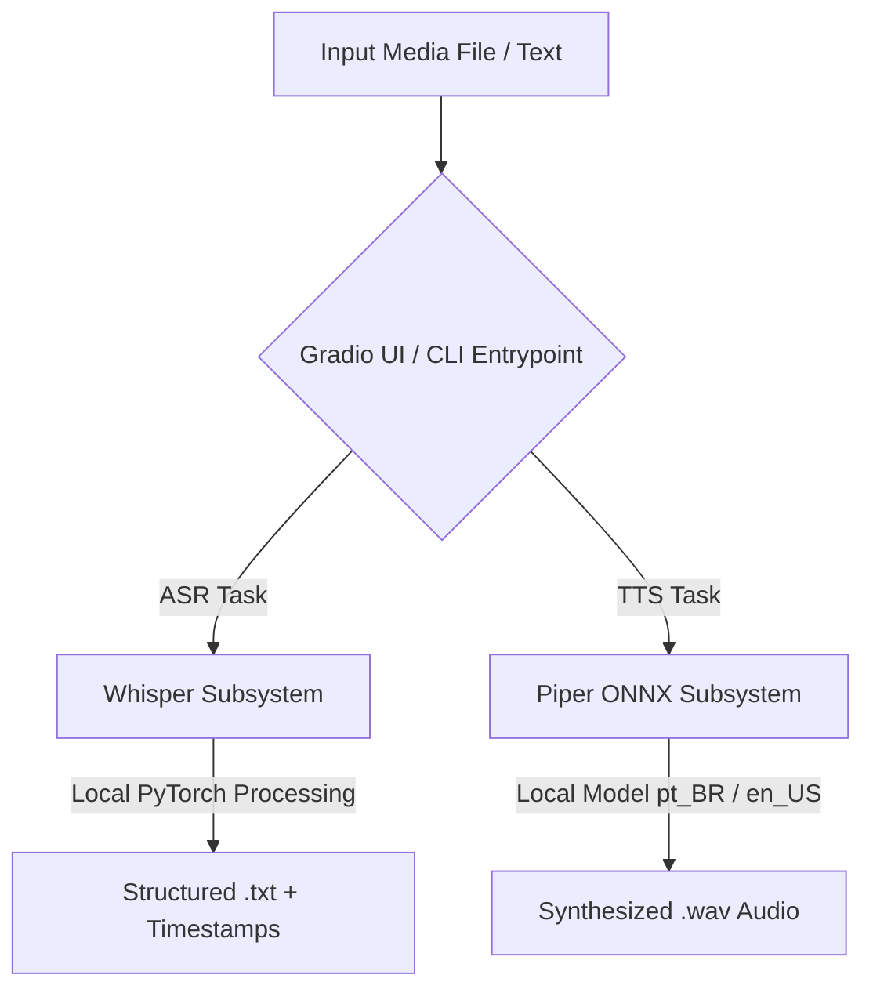

<div align="center">
  <p align="right">
    <b>English 🇺🇸</b> | <a href="./README_pt.md">[Read in Portuguese 🇧🇷]</a>
  </p>

  
  <h1>Fofoca Transcriptor</h1>
  <p><b>An Intelligent, 100% Offline Ecosystem for Media Transcription and Neural Speech Synthesis</b></p>

  [](https://www.python.org/)
  [](https://gradio.app/)
  [](https://github.com/openai/whisper)
  [](https://github.com/rhasspy/piper)
  [](https://github.com/astral-sh/ruff)
  [](LICENSE)

  <p><i>Engineered by <b>Sueli da Hora Moreira</b></i></p>
</div>

---

## 📖 About the Project

**Fofoca Transcriptor** is a modular Python toolkit engineered for **audio/video transcription** and **neural text-to-speech synthesis** executing entirely on local infrastructure. It eliminates external cloud dependencies, subscription barriers, API rate limits, and file size constraints.

### 🏛️ High-Level Ecosystem Architecture



### 💡 Motivation & Architecture Goals

The project was designed to address common friction points encountered when processing extensive technical audio recordings (such as 2+ hour lectures on LLMs and RAG architectures):
* **No File Size or Duration Limits:** Standard web tools impose restrictive daily caps and fail on long audio files. Fofoca Transcriptor processes files of any size without restriction.
* **100% Data Privacy:** Zero outbound network traffic for inference. All media, transcripts, and audio files remain strictly confidential on the local machine.
* **Cost Efficiency & Autonomy:** Replaces recurring paid transcription services with state-of-the-art open-source neural models running on consumer hardware.

---

### 📸 Interface da Aplicação & Modos de Operação

O **Fofoca Transcriptor** oferece uma interface gráfica intuitiva desenvolvida em Gradio, operando 100% local, privada e dividida em dois fluxos especializados:

| 🎙️ Módulo 1: Audio-to-Text (Whisper Local) | 🔊 Módulo 2: Text-to-Audio (Piper TTS Local) |
| :---: | :---: |
|  |  |
| **Reconhecimento automático de fala com timestamps precisos [MM:SS]** | **Síntese neural de voz multibilíngue com player interativo e exportação WAV** |

---

## ✨ Key Capabilities

* 🔒 **Local & Air-Gapped Execution:** Full offline inference for both speech-to-text and text-to-speech workflows.
* 🎯 **OpenAI Whisper Transcription Engine:**
  * Configurable model granularity: `tiny`, `base`, `small`, `medium`, and `large`.
  * Automatic language identification across 90+ languages.
  * Segmented timestamp formatting (`[MM:SS]`) for seamless navigation.
  * One-click clipboard copy and automated `.txt` export.
* 🗣️ **Piper Neural TTS Engine:**
  * High-performance local ONNX voice models:
    * **Portuguese (pt_BR):** `pt_BR-faber-medium`
    * **English (en_US):** `en_US-lessac-medium`
  * Direct audio streaming and `.wav` download.
* 🗂️ **Clean Codebase & Extensibility:** Decoupled CLI modules (`transcriber.py`, `speaker.py`) unified under a production-ready Gradio entrypoint (`app.py`).

---

## 📊 Key Metrics & Engineering Impact

| Metric / Dimension | Commercial SaaS APIs | Fofoca Transcriptor (Local) | Engineering Impact |
|---|---|---|---|
| **Recurring Financial Cost** | ~$0.006 - $0.024 / min | **$0.00 (Zero)** | **100% SaaS cost reduction** for unlimited media processing |
| **Outbound Data Telemetry** | 100% sent to external servers | **0 MB (Air-Gapped)** | Total data sovereignty & GDPR/LGPD compliance |
| **Maximum File Duration** | Typically capped at 20–30 min | **Unlimited (Tested 2h+)** | Zero pipeline rejection on large technical lectures |
| **Inference Determinism** | Variable latency / API outages | **Deterministic Local Runtime** | Fully resilient against external service downtimes |
| **Dependency Resolution** | Standard `pip` (>30s) | **`uv` (<2s resolution)** | 10x faster developer onboarding and CI execution |

---

## 🛠️ Tech Stack

| Component | Technology | Purpose |
|---|---|---|
| **Language** | Python 3.12+ | Core runtime environment |
| **Web Interface** | Gradio 6.x | Interactive browser UI |
| **ASR Engine** | OpenAI Whisper | Automatic speech recognition & timestamp alignment |
| **TTS Engine** | Piper TTS | Neural speech synthesis via ONNX runtime |
| **Deep Learning** | PyTorch & TorchAudio | Tensor computation & media processing backend |
| **Package Management** | uv / pip | Deterministic dependency resolution |
| **Linter & Code Quality** | Ruff | Ultra-fast linting and static code analysis |
| **Testing** | pytest | Automated test suite |

---

## 📚 Technical Documentation & Specs

For detailed technical specifications, design documents, and product requirements:
* 📄 **[Product Requirements Document (PRD)](./docs/PRD.md)**: Product goals, functional/non-functional requirements, target personas, and validation metrics.
* 🏛️ **[Technical Architecture Document](./docs/ARCHITECTURE.md)**: Detailed component interactions, sequence diagrams, and persistence strategy.
* 🤝 **[Contributing Guidelines](./CONTRIBUTING.md)**: Development workflow, coding standards, and pull request checklist.

---

## 📂 Directory Structure

```text
fofoca/
├── .github/workflows/       # Continuous Integration workflows
│   └── ci.yml               # Automated test runner with uv, ruff & pytest
├── assets/                  # Brand assets and UI preview captures
│   ├── logo.png             # Project emblem
│   ├── telaAT.jpg           # Audio-to-Text tab screenshot
│   └── telaTA.jpg           # Text-to-Audio tab screenshot
├── audio-to-text/           # Transcription subsystem
│   ├── input/               # Staging area for raw audio/video files
│   ├── output/              # Processed transcription transcripts (.txt)
│   └── src/                 # Whisper processing script (transcriber.py)
├── docs/                    # Architectural & engineering documentation
│   ├── ARCHITECTURE.md      # Detailed system architecture and data flows
│   └── PRD.md               # Product Requirements Document
├── text-to-audio/           # Speech synthesis subsystem
│   ├── input/               # Source text files (.txt)
│   ├── models/              # Neural ONNX voice models & JSON definitions
│   │   ├── pt_BR-faber-medium.onnx
│   │   ├── pt_BR-faber-medium.onnx.json
│   │   ├── en_US-lessac-medium.onnx
│   │   └── en_US-lessac-medium.onnx.json
│   ├── output/              # Synthesized audio files (.wav)
│   └── src/                 # Synthesis script (speaker.py)
├── tests/                   # Automated unit & integration tests
│   └── test_basic.py        # Structural and module validation tests
├── .env.example             # Configuration template
├── CONTRIBUTING.md          # Contribution guidelines
├── app.py                   # Gradio Web Application
├── main.py                  # CLI Entrypoint
├── pyproject.toml           # Package configuration & dependencies
├── README.md                # Documentation (English)
└── README_pt.md             # Documentation (Português)
```

---

## 🚀 Local Installation & Setup

### Prerequisites

* **Python 3.12** or newer
* **FFmpeg** installed and added to the system `PATH`
* **Git**

### 1. Clone the Repository

```bash
git clone https://github.com/SueliHora/fofoca.git
cd fofoca
```

### 2. Set Up Environment & Install Dependencies

#### Using `uv` (Recommended)

```bash
uv sync --dev
```

#### Using `pip`

```bash
# Create and activate virtual environment
python -m venv .venv

# Windows (PowerShell)
.venv\Scripts\Activate.ps1

# Linux / macOS
# source .venv/bin/activate

# Install dependencies
pip install .
```

### 3. Fetch Neural Voice Models (If Not Present)

```bash
# Brazilian Portuguese Model (pt_BR - Faber)
curl -L -o "text-to-audio/models/pt_BR-faber-medium.onnx" "https://huggingface.co/rhasspy/piper-voices/resolve/main/pt/pt_BR/faber/medium/pt_BR-faber-medium.onnx"
curl -L -o "text-to-audio/models/pt_BR-faber-medium.onnx.json" "https://huggingface.co/rhasspy/piper-voices/resolve/main/pt/pt_BR/faber/medium/pt_BR-faber-medium.onnx.json"

# American English Model (en_US - Lessac)
curl -L -o "text-to-audio/models/en_US-lessac-medium.onnx" "https://huggingface.co/rhasspy/piper-voices/resolve/main/en/en_US/lessac/medium/en_US-lessac-medium.onnx"
curl -L -o "text-to-audio/models/en_US-lessac-medium.onnx.json" "https://huggingface.co/rhasspy/piper-voices/resolve/main/en/en_US/lessac/medium/en_US-lessac-medium.onnx.json"
```

### 4. Run the Application

Launch the Gradio server:

```bash
uv run python app.py
```

*(or `python app.py`)*

Open your browser and navigate to:
👉 **[http://localhost:7860](http://localhost:7860)**

### 5. Quality Assurance & Tests

Run linting and the automated test suite:

```bash
# Lint checks
uv run ruff check .

# Automated unit tests
uv run pytest -v
```

---

## ⚖️ Trade-offs & Lessons Learned

### 1. 100% Local Processing vs. Cloud-Based SaaS APIs
* **The Decision:** Deploying local neural models (Whisper + Piper ONNX) instead of delegating inference to cloud endpoints (such as OpenAI Whisper API or ElevenLabs).
* **The Trade-offs:**
  * **Advantages:** Absolute data privacy (air-gapped compliance), zero ongoing per-minute costs, and no artificial caps on file size or recording duration.
  * **Considerations:** Inference speed and throughput depend directly on host machine resources (CPU cores, RAM, and GPU availability). Larger Whisper models (`medium`, `large`) demand significant VRAM/RAM compared to instantaneous remote cloud workers.

### 2. Modern Package Management (`uv`) vs. Traditional `pip`
* **The Decision:** Adopting `uv` as the primary workspace dependency manager and lockfile engine.
* **The Trade-offs:**
  * **Advantages:** 10x-100x faster package resolution and installation times, deterministic environment locking (`uv.lock`), and unified Python version management across multiple operating systems.
  * **Considerations:** Requires contributors to install `uv`, although standard `pip` remains fully backward-compatible via `pyproject.toml`.

### 3. Gradio vs. Heavy Custom Frontend Frameworks (React / Vue / Next.js)
* **The Decision:** Building the graphical user interface with Gradio's Blocks API rather than decoupling into a separate Node.js/React frontend.
* **The Trade-offs:**
  * **Advantages:** Extremely high engineering velocity, native Python state handling, seamless media streaming (audio player, file uploads), and zero JavaScript build pipeline overhead.
  * **Considerations:** While Gradio is ideal for AI/ML desktop and web prototypes, highly customized pixel-level micro-interactions are constrained by Gradio's component architecture, mitigated by custom CSS injection.

---

## 📜 License

This project is licensed under the [MIT License](LICENSE).

---

<div align="center">
  <p>Created by <b>Sueli da Hora Moreira</b></p>
</div>
