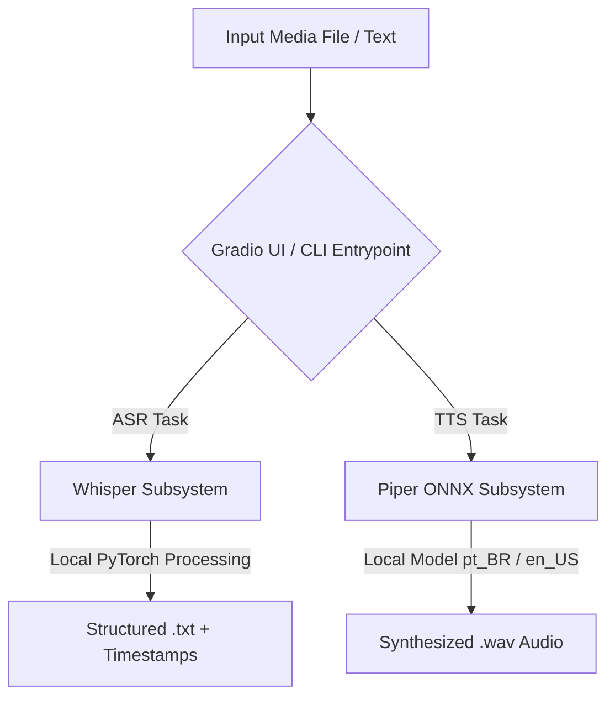

<div align="center">
  <p align="right">
    <a href="./README.md">[Read in English 🇺🇸]</a> | <b>Português 🇧🇷</b>
  </p>

  
  <h1>Fofoca Transcriptor</h1>
  <p><b>Ecossistema Inteligente e 100% Offline para Transcrição de Mídia e Síntese de Voz Neural</b></p>

  [](https://www.python.org/)
  [](https://gradio.app/)
  [](https://github.com/openai/whisper)
  [](https://github.com/rhasspy/piper)
  [](LICENSE)

  <p><i>Desenvolvido por <b>Sueli da Hora Moreira</b></i></p>
</div>

---

## 📖 Sobre o Projeto

O **Fofoca Transcriptor** é um ecossistema modular desenvolvido em Python para realizar **transcrição de áudio/vídeo** e **síntese de voz neural (Text-to-Speech)** diretamente em hardware local. A arquitetura elimina a necessidade de conexões com serviços em nuvem, assinaturas pagas, limites de chamadas de API e restrições no tamanho dos arquivos.

### 🏛️ Arquitetura do Ecossistema



### 💡 Motivação e Objetivos de Engenharia

O projeto foi concebido para resolver gargalos práticos no processamento de gravações técnicas extensas (como palestras e conferências de mais de 2 horas sobre RAG e LLMs):

* **Sem Restrições de Duração ou Tamanho:** Ferramentas gratuitas online impõem limites diários rígidos e falham ao processar arquivos longos. O Fofoca Transcriptor processa gravações de qualquer tamanho sem restrições.
* **Privacidade Absoluta dos Dados:** Zero tráfego de rede externo para inferência. Todo o material transcrito e sintetizado permanece confidencial no ambiente local.
* **Autonomia e Baixo Custo:** Substituição de plataformas proprietárias recorrentes por modelos neurais de código aberto de última geração executados localmente.

---

## 🖼️ Demonstração da Interface

A aplicação oferece uma interface gráfica web moderna e responsiva construída com **Gradio**, organizada em dois fluxos de trabalho especializados:

### 🎙️ 1. Módulo Audio-to-Text (Whisper)
>
> Reconhecimento automático de fala (ASR) de alta precisão com suporte a múltiplos formatos de mídia, seleção modular de modelos e geração de timestamps sincronizados.

<div align="center">
  
</div>

<br>

### 🔊 2. Módulo Text-to-Audio (Piper TTS)
>
> Síntese de voz neural local ultrarrápida utilizando modelos ONNX otimizados, com reprodução direta no navegador e exportação para arquivos `.wav`.

<div align="center">
  
</div>

---

## ✨ Principais Funcionalidades

* 🔒 **Processamento 100% Offline (Air-Gapped):** Execução local completa para os pipelines de reconhecimento de fala e síntese de voz.
* 🎯 **Motor de Transcrição OpenAI Whisper:**
  * Seleção flexível de granularidade do modelo: `tiny`, `base`, `small`, `medium` e `large`.
  * Reconhecimento automático de idiomas entre mais de 90 línguas suportadas.
  * Formatação opcional com marcações de tempo segmentadas (`[MM:SS]`).
  * Botão de cópia instantânea para a área de transferência e download do arquivo `.txt`.
* 🗣️ **Motor de Síntese Neural Piper TTS:**
  * Modelos ONNX de alta performance:
    * **Português Brasileiro (pt_BR):** `pt_BR-faber-medium`
    * **Inglês Americano (en_US):** `en_US-lessac-medium`
  * Reprodução em tempo real e download de arquivos `.wav`.
* 🗂️ **Arquitetura Modular:** Scripts CLI isolados (`transcriber.py`, `speaker.py`) integrados sob uma interface gráfica unificada (`app.py`).

---

## 🛠️ Tecnologias Utilizadas

| Componente | Tecnologia | Finalidade |
| --- | --- | --- |
| **Linguagem** | Python 3.12+ | Ambiente de execução principal |
| **Interface Web** | Gradio 6.x | Interface gráfica interativa no navegador |
| **Motor de ASR** | OpenAI Whisper | Reconhecimento de fala e alinhamento de timestamps |
| **Motor de TTS** | Piper TTS | Síntese de voz neural local via runtime ONNX |
| **Deep Learning** | PyTorch & TorchAudio | Computação tensorial e processamento de áudio |
| **Gerenciamento de Pacotes** | uv / pip | Resolução determinística de dependências |
| **Testes Automatizados** | pytest | Validação contínua da suíte de testes |

---

## 📚 Documentação Técnica & Especificações

Para aprofundamento na arquitetura, decisões técnicas e requisitos do produto:

* 📄 **[Documento de Requisitos de Produto (PRD)](./docs/PRD.md)**: Objetivos do produto, personas, requisitos funcionais e não-funcionais.
* 🏛️ **[Documento de Arquitetura Técnica](./docs/ARCHITECTURE.md)**: Detalhamento de subsistemas, diagramas de sequência e estratégia de persistência em disco.

---

## 📂 Estrutura de Diretórios

```text
fofoca/
├── .github/workflows/       # Workflows de Integração Contínua (CI)
│   └── ci.yml               # Execução automatizada de testes com uv & pytest
├── assets/                  # Identidade visual e screenshots da interface
│   ├── logo.png             # Logotipo do projeto
│   ├── telaAT.jpg           # Screenshot do módulo Audio-to-Text
│   └── telaTA.jpg           # Screenshot do módulo Text-to-Audio
├── audio-to-text/           # Subsistema de Transcrição
│   ├── input/               # Diretório de entrada para arquivos de mídia
│   ├── output/              # Transcrições salvas (.txt)
│   └── src/                 # Script de transcrição via Whisper (transcriber.py)
├── docs/                    # Documentação técnica e de engenharia
│   ├── ARCHITECTURE.md      # Arquitetura detalhada do sistema
│   └── PRD.md               # Product Requirements Document
├── text-to-audio/           # Subsistema de Síntese de Voz
│   ├── input/               # Diretório de entrada para arquivos de texto (.txt)
│   ├── models/              # Modelos neurais ONNX e metadados JSON
│   │   ├── pt_BR-faber-medium.onnx
│   │   ├── pt_BR-faber-medium.onnx.json
│   │   ├── en_US-lessac-medium.onnx
│   │   └── en_US-lessac-medium.onnx.json
│   ├── output/              # Áudios gerados (.wav)
│   └── src/                 # Script de síntese de voz (speaker.py)
├── tests/                   # Testes unitários e de integração
│   └── test_basic.py        # Validações estruturais e de módulos
├── .env.example             # Modelo de variáveis de ambiente
├── app.py                   # Interface Gráfica Gradio
├── main.py                  # Ponto de entrada CLI
├── pyproject.toml           # Configuração de pacote e dependências
├── README.md                # Documentação em Inglês
└── README_pt.md             # Documentação em Português
```

---

## 🚀 Como Executar o Projeto Localmente

### Pré-requisitos

* **Python 3.12** ou superior instalado
* **FFmpeg** instalado e configurado no `PATH` do sistema
* **Git**

### 1. Clonar o Repositório

```bash
git clone https://github.com/SueliHora/fofoca.git
cd fofoca
```

### 2. Configurar o Ambiente Virtual e Instalar Dependências

#### Utilizando `uv` (Recomendado)

```bash
uv sync
```

#### Utilizando `pip`

```bash
# Criar e ativar o ambiente virtual
python -m venv .venv

# Windows (PowerShell)
.venv\Scripts\Activate.ps1

# Linux / macOS
# source .venv/bin/activate

# Instalar dependências do projeto
pip install .
```

### 3. Baixar os Modelos de Voz Neurais (se necessário)

```bash
# Modelo em Português (pt_BR - Faber)
curl -L -o "text-to-audio/models/pt_BR-faber-medium.onnx" "https://huggingface.co/rhasspy/piper-voices/resolve/main/pt/pt_BR/faber/medium/pt_BR-faber-medium.onnx"
curl -L -o "text-to-audio/models/pt_BR-faber-medium.onnx.json" "https://huggingface.co/rhasspy/piper-voices/resolve/main/pt/pt_BR/faber/medium/pt_BR-faber-medium.onnx.json"

# Modelo em Inglês (en_US - Lessac)
curl -L -o "text-to-audio/models/en_US-lessac-medium.onnx" "https://huggingface.co/rhasspy/piper-voices/resolve/main/en/en_US/lessac/medium/en_US-lessac-medium.onnx"
curl -L -o "text-to-audio/models/en_US-lessac-medium.onnx.json" "https://huggingface.co/rhasspy/piper-voices/resolve/main/en/en_US/lessac/medium/en_US-lessac-medium.onnx.json"
```

### 4. Iniciar a Aplicação

Execute o servidor Gradio:

```bash
uv run python app.py
```

*(ou `python app.py`)*

Abra seu navegador e acesse:
👉 **[http://localhost:7860](http://localhost:7860)**

### 5. Executar os Testes Automatizados

Rode a suíte de testes com `pytest`:

```bash
uv run pytest -v
```

---

## ⚖️ Decisões de Engenharia & Lições Aprendidas

### 1. Processamento 100% Local vs. APIs em Nuvem

* **A Decisão:** Executar inferência neural exclusivamente em hardware local (Whisper + Piper ONNX) em vez de consumir APIs pagas de terceiros (como OpenAI API ou ElevenLabs).
* **Os Trade-offs:**
  * **Vantagens:** Privacidade irrestrita dos dados (isolamento air-gapped), custo contínuo zero e ausência de limites arbitrários de tempo ou tamanho de arquivo.
  * **Considerações:** A velocidade e a capacidade de processamento dependem diretamente do hardware local (núcleos de CPU, memória RAM e GPU disponível). Modelos maiores do Whisper (`medium`, `large`) demandam maior alocação de memória se comparados a servidores em nuvem.

### 2. Adoção do `uv` vs. `pip` Tradicional

* **A Decisão:** Utilizar o gerenciador `uv` da Astral como padrão principal do repositório para resolução e sincronização de dependências.
* **Os Trade-offs:**
  * **Vantagens:** Resolução e download de pacotes ordens de magnitude mais rápidos (escrito em Rust), lockfile determinístico (`uv.lock`) e facilidade no gerenciamento de versões do Python.
  * **Considerações:** Requer instalação do binário `uv` pelo desenvolvedor, mantendo no entanto total compatibilidade com `pip` via `pyproject.toml`.

### 3. Gradio vs. Frameworks Frontend Complexos (React / Vue / Next.js)

* **A Decisão:** Adotar a interface gráfica baseada em componentes Gradio Blocks em detrimento de uma arquitetura separada de frontend/backend.
* **Os Trade-offs:**
  * **Vantagens:** Velocidade máxima de desenvolvimento e entrega, integração nativa com o ciclo de vida do Python, suporte automático a streaming de áudio/mídia e zero overhead de pipelines JavaScript/Node.js.
  * **Considerações:** Customizações visuais hiperespecíficas são limitadas pelos componentes nativos do Gradio, sendo mitigadas via injeção de CSS personalizado no layout.

---

## 📜 Licença

Este projeto está sob a licença [MIT](LICENSE).

---

<div align="center">
  <p>Desenvolvido por <b>Sueli da Hora Moreira</b></p>
</div>
