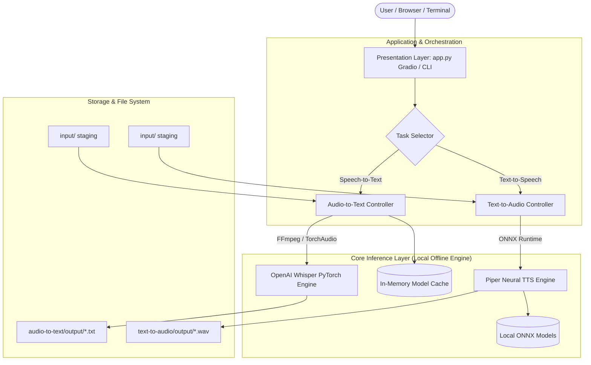
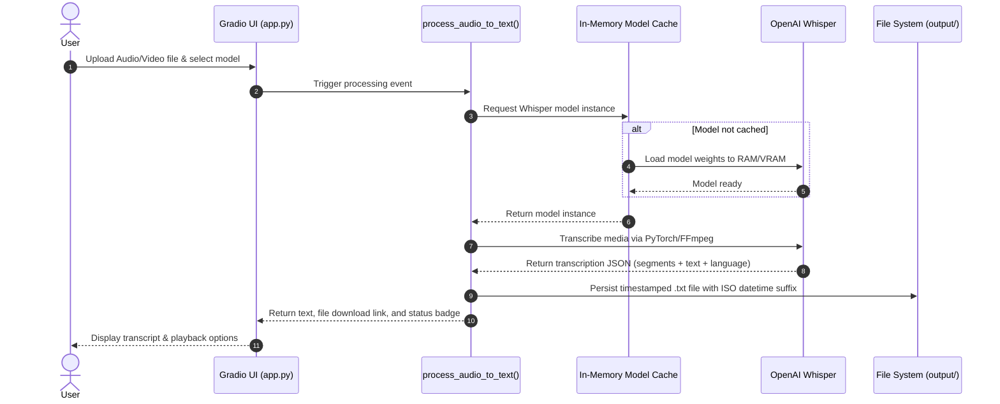
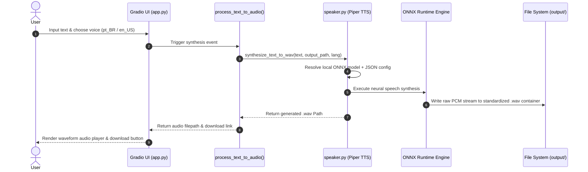

# Technical Architecture & Engineering Design

## Project: Fofoca Transcriptor
**Author & Tech Lead:** Sueli da Hora Moreira  
**Architecture Status:** Approved / Scalable Modular Monolith  
**Runtime:** Python 3.12+ (PyTorch + ONNX Runtime + Gradio)  

---

## 1. System Overview

**Fofoca Transcriptor** is architectured as a decoupled, modular local application. The system separates user interaction, task orchestration, and heavy deep learning inference into clear subsystem boundaries.



---

## 2. Subsystems & Component Architecture

The codebase is organized into three primary architectural tiers:

### 2.1 Presentation & Orchestration Layer (`app.py`, `main.py`)
* **`app.py`:** Hosts the Gradio application using the **Blocks API**. It defines reactive UI components, handles event loops, provides localized custom CSS styling, and routes incoming user payloads to backend processing functions.
* **`main.py`:** Provides an entrypoint wrapper that initializes and launches the web interface with configured network bindings.
* **Model Cache Management:** Implements an in-memory dictionary cache (`_whisper_cache`) in `app.py` to prevent redundant weights loading on successive requests, minimizing latency.

### 2.2 Speech-to-Text Subsystem (`audio-to-text/`)
* **`audio-to-text/src/transcriber.py`:** Core CLI automation module. Contains helper utilities (`get_all_input_files`, `transcribe_media`) for headless batch processing.
* **Inference Engine:** Powered by **OpenAI Whisper**. Audio decoding is delegated to FFmpeg through Whisper's internal pipeline, feeding normalized Mel-spectrogram tensors into Transformer encoder-decoder blocks.
* **Timestamp & Segment Extraction:** Extracts temporal segment intervals from the model's output dictionary, formatting time coordinates into `[MM:SS]` segments alongside decoded transcript strings.

### 2.3 Text-to-Speech Subsystem (`text-to-audio/`)
* **`text-to-audio/src/speaker.py`:** Core TTS synthesis module. Exposes `synthesize_text_to_wav` and `convert_text_to_speech`.
* **Inference Engine:** Powered by **Piper TTS** built on top of the **ONNX Runtime (Open Neural Network Exchange)**. It utilizes lightweight neural acoustic and vocoder models (VITS architecture) to generate synthetic waveform audio with high computational efficiency.
* **Model Mapping & Resolution:** Implements deterministic lookup across local ONNX model checkpoints (`pt_BR-faber-medium.onnx` and `en_US-lessac-medium.onnx`) and their corresponding `.onnx.json` phoneme dictionaries.

---

## 3. End-to-End Data Flow

### 3.1 Audio-to-Text Pipeline (ASR)



### 3.2 Text-to-Speech Pipeline (TTS)



---

## 4. Storage, Persistence & File System Decisions

```text
fofoca/
├── audio-to-text/
│   ├── input/       # Staging area for batch media files (.mp3, .mp4, .mkv, etc.)
│   ├── output/      # Generated transcripts (.txt) with naming pattern {name}_{timestamp}.txt
│   └── src/         # Standalone transcription pipeline code
├── text-to-audio/
│   ├── input/       # Staging area for batch text documents (.txt)
│   ├── models/      # Local neural ONNX voice models and JSON phoneme configs
│   ├── output/      # Synthesized audio files (.wav) with naming pattern fofoca_audio_{timestamp}.wav
│   └── src/         # Standalone TTS pipeline code
```

### Persistence Principles:
1. **Collision Prevention:** Output filenames are generated with millisecond/second-level timestamps (`%Y%m%d_%H%M%S`), preventing race conditions and accidental overwrites during rapid sequential runs.
2. **Deterministic Folder Separation:** Input media, voice models, and generated outputs are strictly isolated in designated folders, facilitating clean `.gitignore` management, automated backup routines, and disk pruning.
3. **Relative Path Resolution:** Scripts use `Path(__file__).resolve().parent` paradigms, ensuring execution stability whether invoked from the repository root, subfolders, or external wrappers.

---

## 5. Security, Privacy & Air-Gapped Guarantees

* **Zero Outbound Telemetry:** All inference computations occur strictly locally via PyTorch and ONNX Runtime. No customer data or audio segments are ever transmitted outside the host environment.
* **No Cloud API Keys Required:** Unlike proprietary APIs, there is zero risk of credential leaks, rate limiting, or vendor lock-in.
* **Clean Artifact Lifecycle:** All files written by the system remain strictly within the workspace folder hierarchy, ensuring easy auditing and compliance with enterprise data governance policies.
